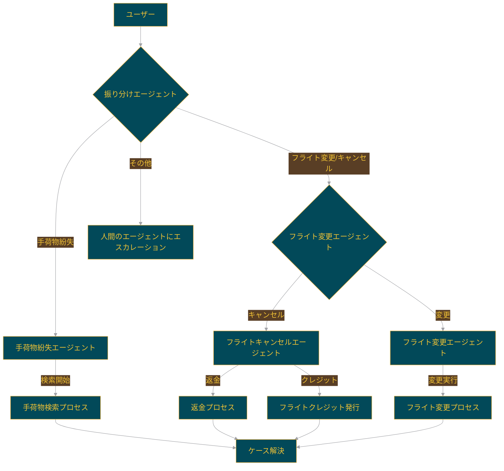

# 構造化された要件定義プロンプト

以下のプロンプトをLLMに入力することで、ユーザーの要求に基づいたSwarmフレームワークの構造と必要なファイル一式を生成できます。

---

# プロンプト:

あなたは優秀なソフトウェアエンジニアです。以下のユーザーからの要件に基づいて、Swarmフレームワークを使用したAIエージェントシステムを設計・実装してください。

**【ユーザーの要件】**

```
[ここにユーザーからの入力や要求を記載]
```

**【要件定義】**

- **目的**: ユーザーの要件を満たすAIエージェントシステムを構築する。
- **フレームワーク**: Swarmフレームワークを使用する。
- **構成**:
  - **エージェント設計**:
    - 必要なエージェントの数と役割を定義する。
    - 各エージェントの指示（instructions）や機能（functions）を詳細に記述する。
  - **機能実装**:
    - エージェントが使用する関数やツールを実装する。
    - 関数の引数や戻り値、処理内容を明確にする。
  - **コンフィギュレーション**:
    - 必要な設定ファイルや環境変数を定義する。
    - エージェント間の連携方法やデータの受け渡しを設計する。
  - **データベースや外部サービス**:
    - 必要に応じてデータベースや外部APIとの連携部分を実装する。
- **ファイル構成**:
  - プロジェクトのディレクトリ構造を提示する。
  - 各ディレクトリやファイルの役割を説明する。
- **サンプルコード**:
  - 主要な部分については実装コードを提供する。
  - `main.py`やエージェントの定義ファイルなど、エントリーポイントとなるコードを含める。
- **動作確認**:
  - システムの起動方法や実行手順を説明する。
  - 必要な依存関係やセットアップ手順を記載する。

**【出力フォーマット】**

プロジェクト全体を以下の形式で出力してください。

1. **概要**: システムの目的や全体像を簡潔に説明する。
2. **ディレクトリ構造**:

   ```
   - project_root/
     - README.md
     - requirements.txt
     - main.py
     - agents/
       - __init__.py
       - agent1.py
       - agent2.py
     - functions/
       - __init__.py
       - function1.py
       - function2.py
     - configs/
       - config.yaml
     - ...
   ```

3. **各ファイルの説明**:
   - **README.md**: プロジェクトの概要と使用方法を記載。
   - **requirements.txt**: 必要なパッケージのリスト。
   - **main.py**: エントリーポイントとなるスクリプト。
   - **agents/**: エージェントの定義と実装。
     - **agent1.py**: エージェント1のコードと詳細。
     - **agent2.py**: エージェント2のコードと詳細。
   - **functions/**: エージェントが使用する関数やツール。
     - **function1.py**: 関数1の実装。
     - **function2.py**: 関数2の実装。
   - **configs/**: 設定ファイルや環境設定。
4. **エージェントの詳細**:
   - 各エージェントの目的、指示、使用する関数を説明。
   - **コード例**を含める。

     例：

     ```python
     # agents/agent1.py

     from swarm import Agent
     from functions.function1 import function1

     agent1 = Agent(
         name="エージェント1",
         instructions="ここにエージェントの指示を記載",
         functions=[function1]
     )
     ```

5. **関数の詳細**:
   - 各関数の役割、引数、戻り値を説明。
   - **コード例**を含める。

     例：

     ```python
     # functions/function1.py

     def function1(param1, param2):
         """
         関数の説明：
         - param1: 説明
         - param2: 説明
         戻り値:
         - 説明
         """
         # 関数の実装
         result = param1 + param2  # 例として簡単な処理
         return result
     ```

6. **セットアップと実行方法**:
   - 必要な環境構築手順。
   - 実行コマンドや動作確認の方法。

     例：

     ```bash
     # 仮想環境の作成と有効化
     python -m venv venv
     source venv/bin/activate  # Windowsの場合は venv\Scripts\activate

     # 必要なパッケージのインストール
     pip install -r requirements.txt

     # メインスクリプトの実行
     python main.py
     ```

7. **その他必要な情報**:
   - 注意点や拡張方法など。

---

**【注意事項】**

- コードや設定ファイルは適切なフォルダに配置し、Pythonのパッケージ構成に従ってください。
- 説明は日本語で記載し、専門用語は適切に翻訳してください。
- ユーザーの要件を正確に反映し、実用的なシステムとなるよう心がけてください。
- 必要に応じてコメントやドキュメンテーションを追加し、可読性を高めてください。
- **コード例を具体的に提供し、ユーザーがそのまま利用できるようにしてください。**

---

以上の指示に従って、Swarmフレームワークを用いたシステムの設計と実装を行ってください。
下記の例も適宜参考にして

# 例 ) Project: airline

```plaintext
OS: nt
Directory: C:\Prj\swarm-sample-box\examples\airline

├─ configs/
│  ├─ agents.py
│  ├─ tools.py
│  ├─ __init__.py
├─ main.py
├─ README.md
├─ __init__.py
```

## .

`main.py`

```python
from configs.agents import *
from swarm.repl import run_demo_loop

# コンテキスト変数の設定
# これらの変数は顧客情報とフライト情報を含み、エージェントの対話に使用されます
context_variables = {
    "customer_context": """ここに顧客の詳細情報があります:
1. CUSTOMER_ID: customer_12345
2. NAME: John Doe
3. PHONE_NUMBER: (123) 456-7890
4. EMAIL: johndoe@example.com
5. STATUS: Premium
6. ACCOUNT_STATUS: Active
7. BALANCE: $0.00
8. LOCATION: 1234 Main St, San Francisco, CA 94123, USA
""",
    "flight_context": """顧客は、ニューヨークのLGA（ラガーディア）からロサンゼルスのLAXへの次の便を予約しています。
フライト番号は1919です。出発日時は2024年5月21日午後3時（東部時間）です。""",
}

if __name__ == "__main__":
    # デモループの実行
    # triage_agentを初期エージェントとして使用し、コンテキスト変数を渡してデバッグモードで実行
    run_demo_loop(triage_agent, context_variables=context_variables, debug=True)

# 解説：
# このスクリプトは、Swarmフレームワークを使用して対話式のカスタマーサービスデモを実行します。
# context_variablesには顧客とフライトの情報が含まれており、これらはエージェントが対話中に参照できます。
# run_demo_loopは、ユーザーとエージェント間の対話を管理し、triage_agentから始まる対話フローを実行します。
```

`README.md`

```markdown
# Swarm airline:  航空会社カスタマーサービス


このサンプルは、Swarmフレームワークを使用して航空会社のコンテキストにおける様々な顧客サービスリクエストを処理するマルチエージェントセットアップを示しています。エージェントはリクエストの振り分け、フライト変更、キャンセル、手荷物紛失ケースを処理できます。
このサンプルでは、対話式のSwarmセッションを作成できる`run_demo_loop`ヘルパー関数を使用しています。

## エージェント

1. **振り分けエージェント**: リクエストの種類を判断し、適切なエージェントに転送します。
2. **フライト変更エージェント**: フライト変更に関するリクエストを処理し、さらに以下に振り分けます：
   - **フライトキャンセルエージェント**: フライトキャンセルリクエストを管理します。
   - **フライト変更エージェント**: フライト変更リクエストを管理します。
3. **手荷物紛失エージェント**: 手荷物紛失の問い合わせを処理します。

## エージェントのフローチャート

以下のフローチャートは、各エージェントの関係と処理の流れを視覚化しています：



このフローチャートは、ユーザーのリクエストがどのように処理され、各エージェントがどのように連携して顧客サービスを提供するかを示しています。

## セットアップ

依存関係とSwarmをインストールしたら、以下のコマンドでサンプルを実行します：

```shell
python3 main.py
```

## 評価

> [!NOTE]
> これらの評価は機能性を示すためのサンプルですが、特定のユースケースに合わせて更新・調整する必要があります。

このサンプルでは、会話と予想される関数呼び出し（関数呼び出しが予想されない場合は'None'）を入力とする機能評価を実行します。
評価ケースは`eval/eval_cases/`サブフォルダに保存されています。

```json
[
  {
    "conversation": [
      { "role": "user", "content": "私の荷物が届きませんでした！" }
    ],
    "function": "transfer_to_lost_baggage"
  },
  {
    "conversation": [
      { "role": "user", "content": "フライト中に乱気流がありました" }
    ],
    "function": "None"
  }
]
```

'function_evals.py'スクリプトが評価を実行します。特定の評価を実行したい回数を`n`に設定してください。ルートの航空会社フォルダからスクリプトを実行するには、以下のコマンドを実行します：

```bash
cd evals
python function_evals.py
```

これらの評価の結果は`evals/eval_results/`に保存されます。
```

`__init__.py`

```python

```

## configs

`configs\agents.py`

```python
from configs.tools import *
from data.routines.baggage.policies import *
from data.routines.flight_modification.policies import *
from data.routines.prompts import STARTER_PROMPT

from swarm import Agent

# 各エージェントへの転送関数
def transfer_to_flight_modification():
    return flight_modification

def transfer_to_flight_cancel():
    return flight_cancel

def transfer_to_flight_change():
    return flight_change

def transfer_to_lost_baggage():
    return lost_baggage

def transfer_to_triage():
    """
    ユーザーを別のエージェントや別のポリシーに転送する必要がある場合にこの関数を呼び出します。
    例えば、ユーザーが現在のエージェントでは扱えないトピックについて質問している場合などに使用します。
    """
    return triage_agent

# 振り分けエージェントの指示を生成する関数
def triage_instructions(context_variables):
    customer_context = context_variables.get("customer_context", None)
    flight_context = context_variables.get("flight_context", None)
    return f"""ユーザーのリクエストを振り分け、適切な意図に転送するためのツールを呼び出してください。
    適切な意図に転送する準備ができたら、ツールを呼び出して転送してください。
    詳細を知る必要はありません。リクエストのトピックだけを理解すればよいです。
    エージェントにリクエストを振り分けるためにより多くの情報が必要な場合は、理由を説明せずに直接質問してください。
    思考プロセスをユーザーと共有しないでください！ユーザーに代わって不合理な仮定をしないでください。
    顧客コンテキストはこちらです: {customer_context}、フライトコンテキストはこちらです: {flight_context}"""

# 各エージェントの定義
# 振り分けエージェント：ユーザーのリクエストを適切なエージェントに振り分ける
triage_agent = Agent(
    name="振り分けエージェント",
    instructions=triage_instructions,
    functions=[transfer_to_flight_modification, transfer_to_lost_baggage],
)

# フライト変更エージェント：フライトの変更やキャンセルに関するリクエストを処理
flight_modification = Agent(
    name="フライト変更エージェント",
    instructions="""あなたは航空会社のカスタマーサービスのフライト変更エージェントです。
      ユーザーがどのサブ意図に紹介されるべきかを決定する専門のカスタマーサービスエージェントです。
意図がフライト変更関連の質問であることは既に分かっています。まず、メッセージ履歴を見て、ユーザーがフライトをキャンセルしたいのか変更したいのかを判断できるか確認してください。
ユーザーがキャンセルリクエストなのか変更リクエストなのかが分かるまで、明確化のための質問をしてください。分かったら、適切な転送関数を呼び出してください。毎回、明確化のための質問をするか、関数の1つを呼び出してください。""",
    functions=[transfer_to_flight_cancel, transfer_to_flight_change],
    parallel_tool_calls=False,
)

# フライトキャンセルエージェント：フライトのキャンセルに特化した処理を行う
flight_cancel = Agent(
    name="フライトキャンセル処理",
    instructions=STARTER_PROMPT + FLIGHT_CANCELLATION_POLICY,
    functions=[
        escalate_to_agent,
        initiate_refund,
        initiate_flight_credits,
        transfer_to_triage,
        case_resolved,
    ],
)

# フライト変更エージェント：フライトの変更に特化した処理を行う
flight_change = Agent(
    name="フライト変更処理",
    instructions=STARTER_PROMPT + FLIGHT_CHANGE_POLICY,
    functions=[
        escalate_to_agent,
        change_flight,
        valid_to_change_flight,
        transfer_to_triage,
        case_resolved,
    ],
)

# 手荷物紛失エージェント：手荷物の紛失に関する問い合わせを処理する
lost_baggage = Agent(
    name="手荷物紛失処理",
    instructions=STARTER_PROMPT + LOST_BAGGAGE_POLICY,
    functions=[
        escalate_to_agent,
        initiate_baggage_search,
        transfer_to_triage,
        case_resolved,
    ],
)

# 解説：
# このファイルでは、各種エージェントとそれらの転送関数を定義しています。
# 各エージェントは特定の役割（振り分け、フライト変更、キャンセル、手荷物紛失）を持ち、
# それぞれに適した指示と利用可能な関数が設定されています。
# エージェント間の転送を管理することで、複雑な顧客サービスのフローを実現しています。
```

`configs\tools.py`

```python
# 人間のエージェントにエスカレーション
def escalate_to_agent(reason=None):
    return f"エージェントにエスカレーション: {reason}" if reason else "エージェントにエスカレーション"

# フライト変更が可能か確認
def valid_to_change_flight():
    return "顧客はフライト変更の資格があります"

# フライト変更を実行
def change_flight():
    return "フライトの変更が成功しました！"

# 返金プロセスを開始
def initiate_refund():
    status = "返金が開始されました"
    return status

# フライトクレジットの発行を開始
def initiate_flight_credits():
    status = "フライトクレジットが正常に開始されました"
    return status

# ケースを解決済みとしてマーク
def case_resolved():
    return "ケースが解決しました。これ以上の質問はありません。"

# 手荷物の捜索プロセスを開始
def initiate_baggage_search():
    return "手荷物が見つかりました！"

# 解説：
# このファイルでは、エージェントが使用できる各種ツール（関数）を定義しています。
# これらの関数は、実際のシステムでは外部APIの呼び出しやデータベース操作などを行うことになりますが、
# このデモでは簡単な文字列を返すだけの実装になっています。
# 各関数は特定の顧客サービスタスク（エスカレーション、フライト変更、返金など）に対応しており、
# エージェントはこれらの関数を呼び出すことで、顧客のリクエストを処理します。
```

`configs\__init__.py`

```python

```


