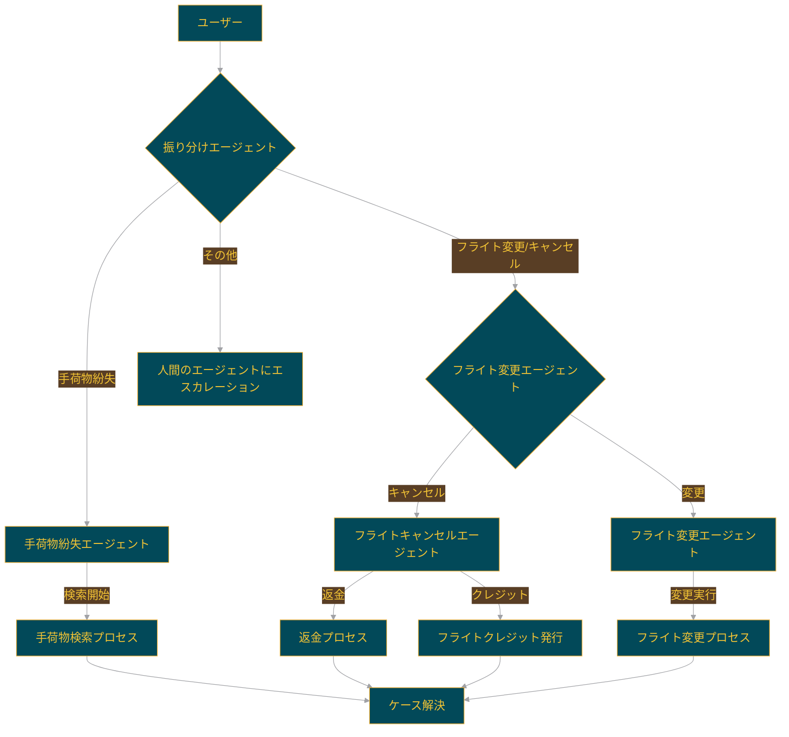

# Swarm airline:  航空会社カスタマーサービス


このサンプルは、Swarmフレームワークを使用して航空会社のコンテキストにおける様々な顧客サービスリクエストを処理するマルチエージェントセットアップを示しています。エージェントはリクエストの振り分け、フライト変更、キャンセル、手荷物紛失ケースを処理できます。
このサンプルでは、対話式のSwarmセッションを作成できる`run_demo_loop`ヘルパー関数を使用しています。

## エージェント

1. **振り分けエージェント**: リクエストの種類を判断し、適切なエージェントに転送します。
2. **フライト変更エージェント**: フライト変更に関するリクエストを処理し、さらに以下に振り分けます：
   - **フライトキャンセルエージェント**: フライトキャンセルリクエストを管理します。
   - **フライト変更エージェント**: フライト変更リクエストを管理します。
3. **手荷物紛失エージェント**: 手荷物紛失の問い合わせを処理します。

## エージェントのフローチャート

以下のフローチャートは、各エージェントの関係と処理の流れを視覚化しています：



このフローチャートは、ユーザーのリクエストがどのように処理され、各エージェントがどのように連携して顧客サービスを提供するかを示しています。

## セットアップ

依存関係とSwarmをインストールしたら、以下のコマンドでサンプルを実行します：

```shell
python3 main.py
```

## 評価

> [!NOTE]
> これらの評価は機能性を示すためのサンプルですが、特定のユースケースに合わせて更新・調整する必要があります。

このサンプルでは、会話と予想される関数呼び出し（関数呼び出しが予想されない場合は'None'）を入力とする機能評価を実行します。
評価ケースは`eval/eval_cases/`サブフォルダに保存されています。

```json
[
  {
    "conversation": [
      { "role": "user", "content": "私の荷物が届きませんでした！" }
    ],
    "function": "transfer_to_lost_baggage"
  },
  {
    "conversation": [
      { "role": "user", "content": "フライト中に乱気流がありました" }
    ],
    "function": "None"
  }
]
```

'function_evals.py'スクリプトが評価を実行します。特定の評価を実行したい回数を`n`に設定してください。ルートの航空会社フォルダからスクリプトを実行するには、以下のコマンドを実行します：

```bash
cd evals
python function_evals.py
```

これらの評価の結果は`evals/eval_results/`に保存されます。
