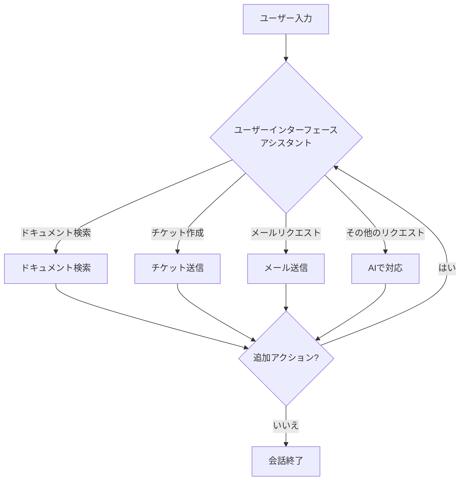

# 🎧 Swarm カスタマーサービスストリーミングエージェント


このプロジェクトは、Swarmフレームワークを使用したカスタマーサービスストリーミングエージェントを示しています。顧客の問い合わせに対応し、OpenAI製品に関する情報を提供し、サポートチケットを管理するように設計されています。

>[!NOTE]
> 本家のプロジェクトでこのサンプルは完成してないか、まだ実験中ぽいのでこのサンプルの実装や使用はお勧めできません。

## 🌟 特徴

- ドキュメント検索：OpenAI製品に関する情報を取得
- チケット送信：問題やリクエストのヘルプチケットを作成
- メール送信：ユーザーとメールでコミュニケーション
- 複数のアシスタント：専門化されたアシスタントで異なるタイプの問い合わせを処理
- ストリーミングレスポンス：ユーザーの問い合わせにリアルタイムで応答

## 🔄 エージェントのワークフロー

以下の図は、カスタマーサービスストリーミングエージェントのワークフローを示しています：



### 主要コンポーネント

1. **ユーザーインターフェースアシスタント**：
   - ユーザー入力を分析し、適切な機能またはサブアシスタントにルーティング
   - 一般的な問い合わせを処理し、応答を調整

2. **ドキュメント検索**：
   - OpenAIのドキュメンテーションから関連情報を取得

3. **チケット送信**：
   - ユーザーの問題やリクエストに対するヘルプチケットを作成

4. **メール送信**：
   - ユーザーへのメールを作成して送信

5. **AI駆動の応答**：
   - 複雑な問い合わせに対して文脈を考慮した応答を生成

このワークフローにより、様々なカスタマーサービスシナリオを効率的に処理できます。

## 🛠️ セットアップ

1. `uv`をインストールしていない場合は、まずインストールします：

```bash
pip install uv
```

2. 仮想環境を作成してアクティベートします：

```bash
uv venv
source .venv/bin/activate  # Linux/macOSの場合
.venv\Scripts\activate  # Windowsの場合
```

3. 必要なパッケージをインストールします：

```bash
uv pip install -r requirements.txt
```

4. Docker-composeを使用してQdrantデータベースを起動します：

```bash
docker-compose up -d
```

この操作により、`docker-compose.yaml`ファイルに定義されたQdrantコンテナが起動します。

## 🚀 エージェントの実行

カスタマーサービスストリーミングエージェントを実行するには：

```bash
python main.py
```

コマンドライン引数を使用して実行をカスタマイズできます：

- `--engine`：使用するエンジンを選択（localまたはassistants）
- `--test`：テストを実行
- `--create-task`：指定した説明で新しいタスクを作成
- `--input`：CLIの入力モードを使用

例：
```bash
python main.py --engine local --input
python main.py --create-task "Answers Transition Guideについて教えて" --assistant user_interface --evaluate
```


## 📁 プロジェクト構造

- `configs/`：アシスタントとツールの設定ファイル
- `logs/`：ログファイル
- `src/`：Swarmフレームワークとタスク処理のソースコード
- `tests/`：テストファイルと評価スクリプト
- `main.py`：カスタマーサービスエージェントを実行するメインスクリプト
- `prep_data.py`：Qdrantベクトルデータベースのデータ準備スクリプト
- `docker-compose.yaml`：Qdrant実行用のDocker設定
- `requirements.txt`：必要なパッケージのリスト

## 🧠 エージェントの拡張

新しい機能を追加するには：

1. `configs/tools/`に新しいツール定義を作成
2. それぞれのツールディレクトリにツールハンドラを実装
3. `configs/assistants/`のアシスタント設定を更新して新しいツールを使用
4. `swarm_tasks.json`ファイルを修正して新しいタスクタイプを含める
