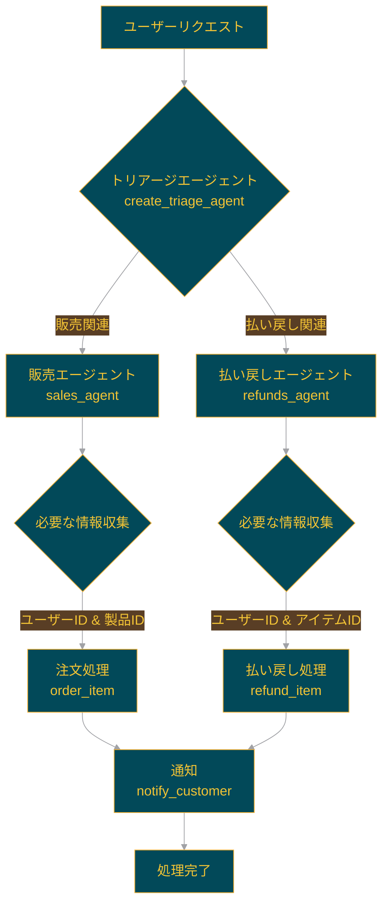

# 🛍️ Swarm personal shopper: パーソナルショッパー


このSwarmは、販売や注文の払い戻しを支援するパーソナルショッピングエージェントです。
このサンプルでは、`run_demo_loop`というヘルパー関数を使用して、インタラクティブなSwarmセッションを作成しています。
また、顧客情報と取引データを格納するSQLite3データベースを使用しています。

## 📋 概要

パーソナルショッパーの例には、さまざまな顧客サービスリクエストを処理する3つの主要なエージェントが含まれています：

1. **トリアージエージェント**: リクエストの種類を判断し、適切なエージェントに転送します。
2. **払い戻しエージェント**: 顧客の払い戻しを管理します。払い戻しを開始するにはユーザーIDとアイテムIDの両方が必要です。
3. **販売エージェント**: 注文に関連するアクションを処理します。購入を完了するにはユーザーIDと製品IDの両方が必要です。

## 🔀 エージェントワークフロー

以下の図は、ユーザーリクエストがどのように処理されるかを示しています：



このワークフローは、ユーザーからのリクエストがトリアージエージェントによって適切なエージェントに振り分けられ、必要な情報が収集された後に処理が行われ、最終的に通知が送られることを示しています。


## 🛠️ セットアップ

依存関係とSwarmをインストールしたら、以下のコマンドでサンプルを実行できます：

```shell
python3 main.py
```

## 🔧 機能

- **データベース管理**: `database.py`ファイルには、SQLite3データベースを初期化し、ユーザー、購入履歴、製品情報を管理する関数が含まれています。
- **エージェントの定義**: `main.py`ファイルで、トリアージエージェント、払い戻しエージェント、販売エージェントが定義されています。
- **インタラクティブセッション**: `run_demo_loop`関数を使用して、ユーザーとエージェント間のインタラクティブなチャットセッションを実現しています。

## 📝 使用方法

1. プログラムを実行すると、インタラクティブなチャットセッションが開始されます。
2. ユーザーは購入や払い戻しに関する質問や要求を入力できます。
3. トリアージエージェントが要求を分析し、適切なエージェント（販売または払い戻し）に転送します。
4. 各エージェントは必要な情報（ユーザーID、製品ID、アイテムIDなど）を収集し、要求を処理します。

## ⚠️ 注意事項

- このサンプルはデモンストレーション目的であり、実際の運用環境での使用には適していません。
- セキュリティ、エラー処理、データ検証などの実装は、実際のアプリケーションでは強化する必要があります。

## 🔧 カスタマイズ

このサンプルを基に、以下のようなカスタマイズが可能です：

- 新しいエージェントの追加（例：カスタマーサポートエージェント）
- データベーススキーマの拡張（例：より詳細な製品情報の追加）
- ユーザー認証システムの実装
- 外部APIとの連携（例：決済システム、在庫管理システムなど）

## 📄 ライセンス

このプロジェクトのライセンス情報については、プロジェクトのルートディレクトリにある`LICENSE`ファイルを参照してください。
