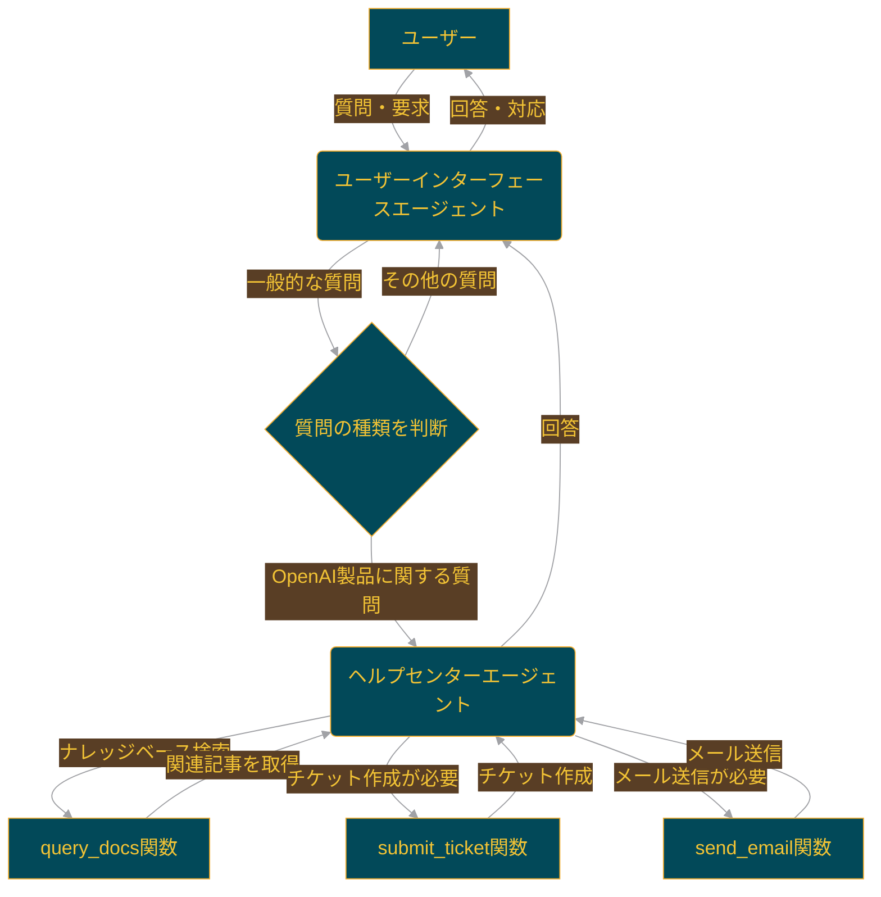

# 🤖 Swarm Support Bot :  カスタマーサービスエージェント


このプロジェクトは、ユーザーインターフェースエージェントとヘルプセンターエージェントを含むカスタマーサービスボットの例です。Swarmライブラリの`run_demo_loop`ヘルパー関数を使用して、インタラクティブなセッションを作成します。

## 🌟 概要

Support Botは主に2つのエージェントで構成されています：

1. **ユーザーインターフェースエージェント**: 最初のユーザー対応を行い、必要に応じてヘルプセンターエージェントに案内します。
2. **ヘルプセンターエージェント**: 様々なツールを使用して詳細なヘルプとサポートを提供します。Qdrant VectorDBとの統合により、ドキュメント検索も可能です。

## 🛠️ セットアップ

Support Botを起動するには以下の手順に従ってください：

### 📋 前提条件

- Dockerがインストールされ、実行中であること
- Python 3.x
- OpenAI APIキー

### 🚀 インストールと実行

1. 必要なライブラリをインストールします：

```shell
make install
```

2. Dockerコンテナを初期化します：

```shell
docker-compose up -d
```

3. ベクターデータベースを準備します：

```shell
make prep
```

4. メインスクリプトを実行します：

```shell
make run
```

## 🔧 uvを使用したセットアップ（Windows PowerShell）

1. 仮想環境を作成し、有効化します：
   ```powershell
   uv venv
   .venv\Scripts\activate
   ```

2. 依存関係をインストールします：
   ```powershell
   uv pip install -r requirements.txt
   ```

3. Dockerコンテナを起動します：
   ```powershell
   docker-compose up -d
   ```

4. データを準備します：
   ```powershell
   python prep_data.py
   ```

5. メインスクリプトを実行します：
   ```powershell
   $env:PYTHONPATH='..\..'; python -m main
   ```

## 🔑 API キーの設定

OpenAI APIキーを環境変数にセットしてください：

```powershell
$env:OPENAI_API_KEY='your-api-key-here'
```

## 🤖 エージェントワークフロー



1. ユーザーが質問や要求を入力します。
2. ユーザーインターフェースエージェントが最初に対応します。
3. 質問の種類に応じて、ユーザーインターフェースエージェントが対応するか、ヘルプセンターエージェントに転送します。
4. ヘルプセンターエージェントは、OpenAI製品に関する質問を処理します。
5. 必要に応じて、ヘルプセンターエージェントは以下の機能を使用します：
   - `query_docs関数`: ナレッジベースを検索して関連記事を取得
   - `submit_ticket関数`: 問題解決のためのチケットを作成
   - `send_email関数`: ユーザーにメールを送信
6. ヘルプセンターエージェントは回答をユーザーインターフェースエージェントに返します。
7. 最終的に、ユーザーインターフェースエージェントがユーザーに回答や対応を提供します。


## 🚨 トラブルシューティング

- モジュールが見つからないエラーが発生した場合は、PYTHONPATHが正しく設定されているか確認してください。
- Qdrantへの接続エラーが発生した場合は、Dockerコンテナが正常に起動しているか確認してください。

## 📁 プロジェクト構造

```plaintext
├─ customer_service.py  # エージェントと主要機能の定義
├─ docker-compose.yaml  # Dockerコンテナの設定
├─ main.py              # メイン実行ファイル
├─ Makefile             # 便利なコマンドのショートカット
├─ prep_data.py         # ベクターデータベース準備スクリプト
├─ README.md            # プロジェクト説明（本ファイル）
├─ requirements.txt     # 必要なPythonパッケージ
└─ __init__.py
```

## 💡 使用方法

セットアップ完了後、`main.py`を実行すると対話型のSupport Botセッションが開始されます。サンプル質問が表示されるので、それらを参考に質問を入力してください。ボットは適切なエージェントを使用して回答を提供します。

## 🤝 貢献

バグの報告や機能の提案は、IssueやPull Requestを通じて歓迎します。

## 📜 ライセンス

このプロジェクトは[MITライセンス](https://opensource.org/licenses/MIT)の下で公開されています。
