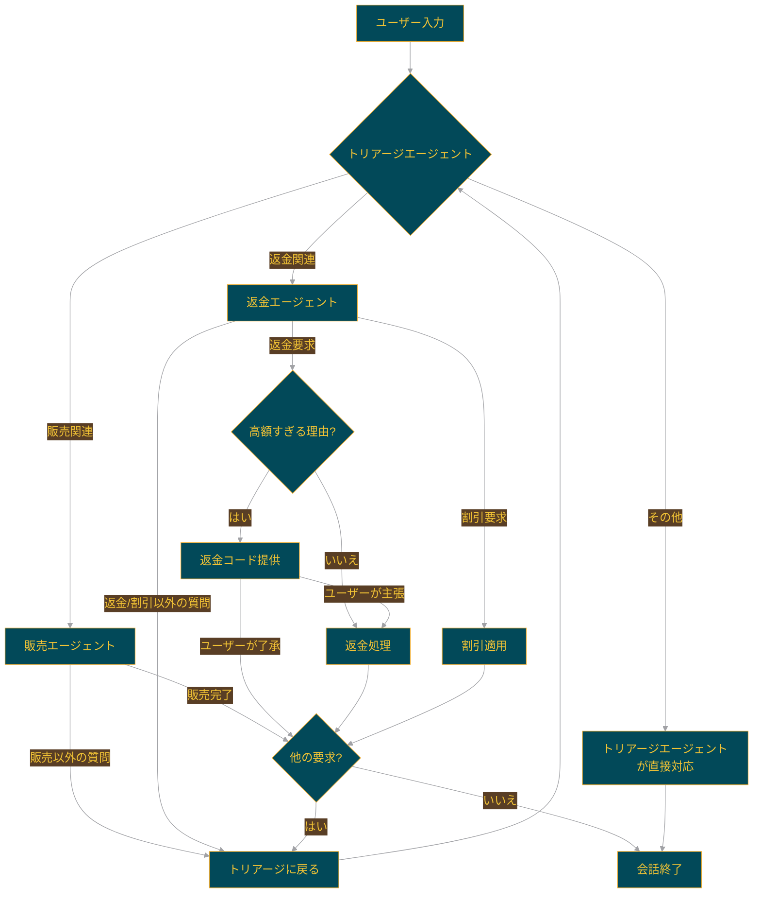

# 🎭 トリアージエージェント


このプロジェクトは、ユーザーの入力を受け取り、適切なエージェントにリクエストを振り分けるトリアージエージェントを含むSwarmの例です。

## 🌟 特徴

- トリアージエージェント: ユーザーの要求を分析し、適切なエージェントに転送
- 販売エージェント: 販売に対して非常に熱心
- 返金エージェント: 返金要求の処理を担当

## 🔄 エージェントのワークフロー

以下の図は、エージェント間の相互作用とワークフローを示しています：



### 主な機能

このワークフローは以下の点を示しています：

1. **トリアージエージェント**:
   - ユーザーの入力を分析し、適切なエージェントに振り分けます。
   - 他のエージェントが処理できない要求を直接処理します。

2. **販売エージェント**:
   - 販売に関連する要求を非常に熱心に処理します。
   - 販売完了後、他の要求がないか確認します。
   - 販売以外の質問を受けた場合、トリアージエージェントに戻ります。

3. **返金エージェント**:
   - 返金要求を処理します。理由が「高額すぎる」場合、まず返金コードを提供します。
   - ユーザーが返金コードに満足しない場合、返金処理を行います。
   - 割引要求に対しては割引を適用します。
   - 返金や割引以外の質問を受けた場合、トリアージエージェントに戻ります。

4. **エージェント間の転送**:
   - 各エージェントは、自身が対応できない要求を受けた場合、トリアージエージェントに戻ります。

このワークフローにより、ユーザーの多様な要求に対して効率的かつ適切に対応することができます。


## 🛠️ セットアップ

1. 仮想環境を作成し、アクティベートします：

```powershell
uv venv
.venv\Scripts\activate
```

2. 必要なパッケージをインストールします：

```powershell
uv pip install -r requirements.txt
```

## 🚀 実行方法

トリアージエージェントSwarmを実行するには：

```shell
python3 run.py
```

## 📊 評価テスト

このプロジェクトでは、`Pytest`を使用してエージェントの動作を評価するユニットテストを実装しています。

### テストの内容

1. 正しいトリアージ関数が呼び出されるかのテスト
2. 会話が「成功」したかどうかの評価テスト（`evals.py`のプロンプトで定義）

### テストの実行方法

基本的なテスト実行：

```shell
pytest evals.py
```

これにより、全てのテストが実行され、成功したテストの数が表示されます。

より詳細なテスト情報を得るためのオプション：

1. 詳細な出力を表示：
   ```shell
   pytest -v evals.py
   ```

2. print文の出力を表示：
   ```shell
   pytest -s evals.py
   ```

3. 詳細な出力とprint文の両方を表示：
   ```shell
   pytest -v -s evals.py
   ```

4. テスト関数名を表示：
   ```shell
   pytest --tb=short evals.py
   ```

5. 失敗したテストのみ詳細を表示：
   ```shell
   pytest -v --tb=no evals.py
   ```

これらのオプションを使用することで、テストの進行状況や詳細な情報を確認できます。特に、`-s`オプションを使用すると、`evals.py`内のlogger.infoステートメントの出力も確認できます。

## 📝 注意事項

これらの評価テストは機能のデモンストレーションを目的としています。実際の使用ケースに合わせて更新・調整する必要があります。

## 📁 ファイル構成

- `agents.py`: 各エージェントとその機能を定義
- `evals.py`: テストケースと評価関数を定義
- `evals_util.py`: LLMを使用した会話評価のユーティリティ関数
- `run.py`: メインのデモループを実行

## 🤝 貢献

このプロジェクトへの貢献を歓迎します。問題の報告や改善の提案は、Issueを作成してください。

## 📜 ライセンス

このプロジェクトのライセンス情報については、リポジトリ内のLICENSEファイルを参照してください。
