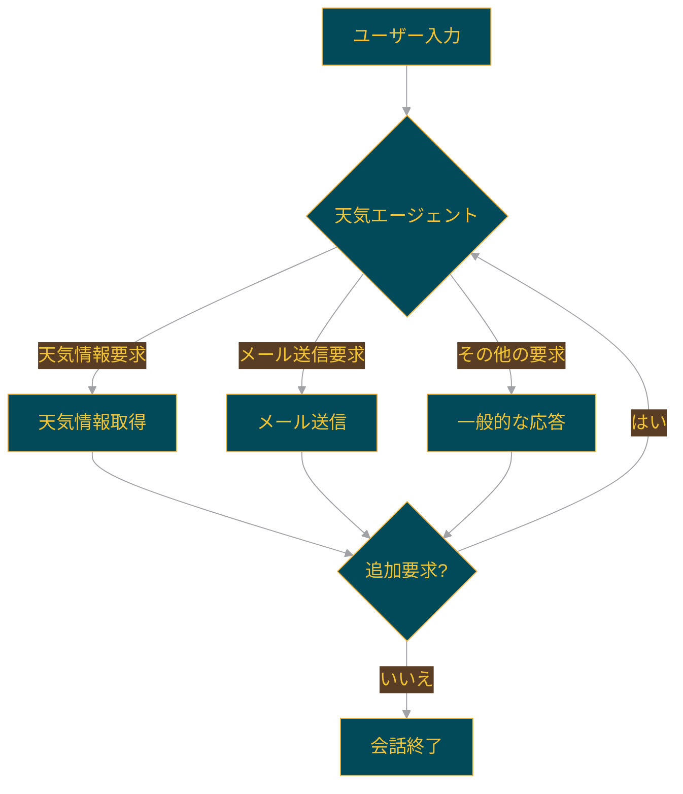

# 🌦️ Swarm Weather agent : 天気エージェント


このプロジェクトは、単一のエージェントによる関数呼び出しを実証する天気エージェントを含む Swarm の例です。

## 🌟 特徴

- 天気情報取得: 特定の都市の天気を取得
- メール送信: 天気情報を含むメールを送信
- 単一エージェント: 複数の機能を1つのエージェントで処理

## 🔄 エージェントのワークフロー

以下の図は、天気エージェントのワークフローを示しています：



### 主な機能

このワークフローは以下の点を示しています：

1. **天気エージェント**:
   - ユーザーの入力を分析し、適切な機能を呼び出します。
   - 天気情報の取得とメール送信の両方の機能を持ちます。

2. **天気情報取得**:
   - 指定された都市の天気情報を取得します。

3. **メール送信**:
   - 取得した天気情報を含むメールを送信します。

4. **一般的な応答**:
   - 天気やメール以外の要求に対して一般的な応答を提供します。

このワークフローにより、ユーザーの天気関連の要求に効率的に対応することができます。


## 🛠️ セットアップ

1. uv をインストールしていない場合は、まず uv をインストールします：

```bash
pip install uv
```

2. 仮想環境を作成し、アクティベートします：

```bash
uv venv
source .venv/bin/activate  # Linux/macOSの場合
.venv\Scripts\activate  # Windowsの場合
```

3. 必要なパッケージをインストールします：

```bash
uv pip install -r requirements.txt
```

この方法により、uv を使用して高速かつ確実にパッケージのインストールと環境のセットアップを行うことができます。

## 🚀 実行方法

天気エージェント Swarm を実行するには：

```bash
python run.py
```

## 📊 評価テスト

このプロジェクトでは、`Pytest` を使用してエージェントの動作を評価するユニットテストを実装しています。

### テストの内容

1. 天気情報を要求された際に正しく `get_weather` 関数が呼び出されるかのテスト
2. 天気と関係ない質問をされた際に `get_weather` 関数が呼び出されないかのテスト

### テストの実行方法

基本的なテスト実行：

```bash
pytest evals.py
```

詳細なテスト情報を得るためのオプション：

```bash
pytest -v evals.py  # 詳細な出力を表示
pytest -s evals.py  # print文の出力を表示
pytest -v -s evals.py  # 詳細な出力とprint文の両方を表示
```

## 📁 ファイル構成

- `agents.py`: 天気エージェントとその機能を定義
- `evals.py`: テストケースと評価関数を定義
- `README.md`: プロジェクトの説明と使用方法
- `requirements.txt`: 必要なパッケージのリスト
- `run.py`: メインのデモループを実行
